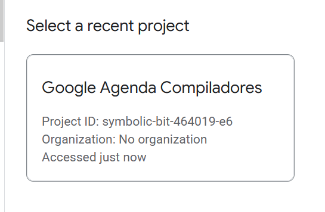

<!-- 
# comp-calendar
Ele trabalha om a logica de construção de compiladores pra criar comandos que serão uteis para API Google Calendar
-->

> Projeto de Construção de Compiladores, 2ee, 2025.1

# Compilador para comandos ao Google Calendar API
## Alunos
- Claudio Roberto
- Ruan de Melo
- Sócrates Farias
- Vinícius Ribeiro

### Descrição: O que faz?
Permite fazer *com facilidade* operações do [Google Calendar](https://calendar.google.com/calendar/u/0/r) (criar, consultar, deletar, repetir eventos) usando comandos escritos em _linguagem natural, estruturada e em potugues_.

### Motivação: qual o Intuito
Que um usuário possa fazer suas devidas organizações, de forma _automatizada_ tarefas que podem ser _chatas e repetitivas_.

> foco: facilidade, automação, podutividade

# Como ultilizar?
Siga o flow abaixo, para ultiliza-lo direto do codespaces!

1. abra o terminal do codespaces e use:
    - ```bash
      pip install antlr4-python3-runtime    # o reconhecedor
      pip install google-api-python-client  # a API do google
      pip install google-auth               # pack para autenticação
      ```
      para instalar as dependencias 

    - `cd src`, para navegar a pasta
<!--2. descopacte o `token.zip` ou coloque um `token.json` da sua conta -->
2. considere colocar um `token.json` de outra conta ou entre na nossa conta de teste:
    - conta gmail: `testecompiladores01@gmail.com`
    - senha: `v9@Lx#T8bW3!dPz2`
    - link do console [Google Cloud](console.cloud.google.com/iam-admin/serviceaccounts) (onde está nosso token)
    - selecione o projeto: <br> <!----> 

    - clique em nas reticências de actions -> Manage keys <br> <!--  --> 
    - por fim, em "add key", selecione `.json`, baixe o arquivo e substitua na pasta do projeto
# Faça sua automação:
3. coloque os seus comandos no `input.txt`
    COMANDOS DISPONIVEIS:
    - `criar evento "NOME" DD-MM-AAAA HH:MM DD-MM-AAAA HH:MM` que cria evento
        <br>ex: `criar evento "Projeto compiladores" 04-07-2025 08:50 04-07-2025 10:30`
        <br>onde:
        - `"NOME"` é o nome do seu evento
        - `DD-MM-AAAA HH:MM` é o formato de dia e hora do seu evento
            > note que no comando você tem que coloar o dia/hora do inicio e o dia/hora do fim do evento
        <br>
    - `deletar evento DD-MM-AAAA` que deleta o evento do dia
    <br>ex: deletar evento 04-07-2025
    - `deletar evento "NOME"` que deleta o evento pelo nome
    <br>ex: deletar evento "Prova Final de Compiladores XD"
    - `consultar evento "NOME"` para consultar o evento, pelo nome
    <br>ex: consultar evento "Correção do 2EE de Compiladores"
    - *Procedimento de repetição*:
    ```
    repetir evento N {
        COMANDOS
    }
    ```
    para poder fazer ações repetitivas
    <br>ex:
    ```
    repetir evento 3 {
        criar evento "Matrícula Assistida" 01-08-2025 14:00 01-08-2025 15:00
    }
    ```


3. inicie o script no formato `python main.py input.txt`.
>obs: o arquivo `input.txt` já segue com um exemplo, fique à vontade para altera-lo
<!--4. ultilize o comando `tal` para...-->
4. abra o [Google Calendar](https://calendar.google.com/calendar/u/0/r) e confira! (o gerador irá exibir o link dirto no prompt)<!--TODO: POR O LINK-->

<!--ver o que luis pediu pra ser feito-->

# Para mais simplicidade ao testar...
criamos um arquivo `iniciar.sh` com todos os comandos necessários para rodar o compilador com uma linha de código!
<br>
coloque no terminal `bash iniciar.sh` e veja a mágica acontecer!!!

## Caso prefira rodar localmente...
Baixe o arquivo `.zip` do nosso [Release Final](https://github.com/proj-compilers/comp-calendar/releases/tag/0.1.0)

---
# Exemplo de funcionamento
Segue fluxo:


> Evento adicionado ao input
<br>
---


>Comando Executado
<br>
---


>Resposta do gerador
<br>
---


>Evento criado com sucesso!!
<br>
---

## Funcionando tbm no codespaces!


>funcionamento no codespaces!
<br>
---
